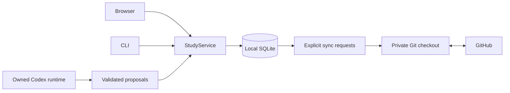

# Practice Room architecture

## Ownership and persistence

The browser and CLI call `StudyService`. Active sessions, candidate text, check metadata, learning artifacts, completion receipts, coaching records, recovery copies, and explicit synchronization requests live in a workspace-specific SQLite database outside the source checkout. Curriculum contracts remain in the repository; new attempts keep a private contract snapshot so an update cannot silently change a check midway through a problem.

The store retains the established JSON/text artifact shapes instead of introducing a second learning model. Its document table provides atomic transactions across those artifacts; its import ledger preserves source versions. SQLite uses WAL, full synchronous commits, short-lived connections, and a shared transaction for nested service/core operations. Learning mutations also use a reentrant process lock. Long-running Git, model, and test work happens outside that transaction.



Completion commits the archive, outcome, reflection, receipt, and removal of the active database pointer together. It does not delete source directories. The session ID is its idempotency identity; retrying an old completion cannot close a new attempt. Generated code-check files can be removed independently. Only a current passing implementation becomes a solution artifact.

Existing read-only history and curriculum helpers can read repository artifacts before a database is initialized. Once a workspace uses `StudyService`, these helpers resolve its learning state from SQLite. The CLI's explicit editor copy uses observed session identity, revision, and digest when importing external edits.

## One problem and honest evidence

The durable state is one current activity. The legacy `practice` API field is a derived compatibility projection containing one stage, rather than another stored parent session. Repairs finish separately. A paused legacy main attempt can remain queued until the next Start action.

Initial reasoning is unknown until recorded/confirmed, and a later self-report cannot erase an initial failure or material help that supplied missing reasoning. Test results, recall, explanation, constraints, and assistance remain distinct. New retention measurements use the initial reasoning timestamp, so closing an old draft after a week cannot manufacture delayed recall. Existing FSRS event dates, corrections, and scheduler parameters are preserved.

An independent assessment needs explicit conversion before conceptual help. Ordinary practice permits requested help after an initial attempt. Code proposals remain previews until explicitly applied. Late work targets the same session and code digest; metadata changes such as a code check do not by themselves invalidate a relevant coach reply.

## Import, export, and recovery

Migration imports legacy schema-5/6 sessions, portable supporting artifacts, public history, and completion receipts without changing their source files. Stable IDs deduplicate repeated imports. Different contents for the same identity remain in recovery. Interrupted grouped completion reuses its original parent/child IDs and time correction. Completed legacy groups stay outside the new workflow-version-4 cohort.

A newer candidate left after an already-recorded completion is preserved as an edited recovery copy, rather than being deleted with the completed pointer. A verified database backup is required before future database-schema upgrades. Originals and the import ledger remain available for review.

Git operates only in the private export checkout. Draft snapshots contain the supported candidate/session files and scoped learning events. Each new attempt uses a distinct draft branch; conflicts preserve both versions. Publication captures the approved artifact set and session IDs, and a changed batch requires a fresh preview. Immutable published evidence is never overwritten to resolve a conflict. Retrying a rejected publication rebuilds its scoped commit on current main, while newer published solution/reflection pointers take precedence over older offline records.

The pending-work records retain explicit publication intent across restart. Worker failure never changes a successful local completion into a failed save. The UI distinguishes the current editor save from the last synchronization result.

## Runtime and API boundaries

The launcher owns one background server per workspace, waits for health, and identifies it by workspace, instance, and build. Only its ownership token can request shutdown. It reuses matching servers, restarts its outdated instance after checkpointing, and leaves unrelated occupied ports alone. The ownership token is not returned by health or diagnostics.

The API version is 2. Mutation inputs are validated; candidate operations include session identity, revision, and code digest. State snapshots carry an ordering token so an older response cannot restore a finished problem. Old browser builds receive a restart/reload instruction before mutation. Storage failures return structured JSON with a diagnostic reference. A completion receipt endpoint reconciles an uncertain HTTP response without repeating the review.

The app pins the official `@openai/codex` package to 0.157.0, uses its native executable, verifies the restricted effective configuration, and signs in through Codex-managed personal ChatGPT authentication. PATH upgrades, global providers, desktop credentials, and API-key fallbacks are outside this connection path. Coaching state has its own ordering and availability signals. Browser recovery is a fallback for unsent edits; a failed browser-storage write never produces a saved claim.

## Validation and release

Run focused Python tests, full pytest, Ruff, interface tests, production build, formatting, and Playwright on Windows and Linux. The suite covers real Windows file locks, an abruptly terminated SQLite writer, legacy saved-data migration, real disposable Git remotes, repeated completion, metadata/edition conflicts, real launcher lifecycle, viewport layouts, normal coaching, interruptions, storage failure, and response reconciliation.

Ordinary pytest and browser fixtures never use a signed-in account. The separate native contract check installs the pinned official binary, generates its version-matched schema, initializes an empty private home, checks the restricted configuration, and verifies that no account was inherited:

```powershell
.\.venv\Scripts\python.exe -m study.runtime_check
```

The final personal-device acceptance requires launching the feature on the Lenovo Yoga, signing in with personal ChatGPT in the app, and confirming a bounded real coaching turn. After sign-in, this command uses the existing managed login for exactly one request in a disposable learning workspace; it does not publish or modify the learner's attempt:

```powershell
.\.venv\Scripts\python.exe -m study.runtime_check --root . --live
```

`--live` is disabled in CI. A timeout or uncertain turn is reported and is not automatically retried. Native initialization and fake-coach journeys are supporting evidence; they do not establish successful authenticated coaching on the Yoga. Keep the feature PR unmerged until the learner's review and that device check pass.