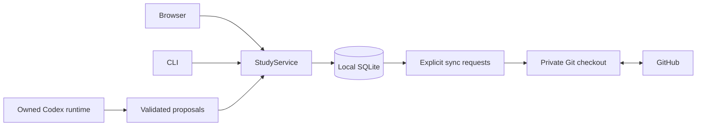

# Practice Room architecture

## Ownership and persistence

The browser and CLI call `StudyService`. Active sessions, candidate text, check metadata, learning artifacts, completion receipts, coaching records, recovery copies, and explicit synchronization requests live in a workspace-specific SQLite database outside the source checkout. Curriculum contracts remain in the repository; new attempts keep a private contract snapshot so an update cannot silently change a check midway through a problem.

The store retains the established JSON/text artifact shapes instead of introducing a second learning model. Its document table provides atomic transactions across those artifacts; its import ledger preserves source versions. SQLite uses WAL, full synchronous commits, short-lived connections, and a shared transaction for nested service/core operations. Learning mutations also use a reentrant process lock. Long-running Git, model, and test work happens outside that transaction.


```mermaid
flowchart LR
    Browser --> Service[StudyService]
    CLI --> Service
    Service --> DB[(Local SQLite)]
    Coach[Owned Codex runtime] --> Proposals[Validated proposals]
    Proposals --> Service
    DB --> Requests[Explicit sync requests]
    Requests --> Export[Private Git checkout]
    Export <--> GitHub
```

Completion commits the archive, outcome, reflection, receipt, and removal of the active database pointer together. It does not delete source directories. The session ID is its idempotency identity; retrying an old completion cannot close a new attempt. Generated code-check files can be removed independently. Only a current passing implementation becomes a solution artifact.

Existing read-only history and curriculum helpers can read repository artifacts before a database is initialized. Once a workspace uses `StudyService`, these helpers resolve its learning state from SQLite. The CLI's explicit editor copy uses observed session identity, revision, and digest when importing external edits.

## One problem and honest evidence

The durable state is one current activity. The legacy `practice` API field is a derived compatibility projection containing one stage, rather than another stored parent session. Repairs finish separately. A paused legacy main attempt can remain queued until the next Start action.

Initial reasoning is unknown until recorded/confirmed, and a later self-report cannot erase an initial failure or material help that supplied missing reasoning. Test results, recall, explanation, constraints, and assistance remain distinct. New retention measurements use the initial reasoning timestamp, so closing an old draft after a week cannot manufacture delayed recall. Existing FSRS event dates, corrections, and scheduler parameters are preserved.

An independent assessment needs explicit conversion before conceptual help. Ordinary practice permits requested help after an initial attempt. Code proposals remain previews until explicitly applied. Late work targets the same session and code digest; metadata changes such as a code check do not by themselves invalidate a relevant coach reply.

## Import, export, and recovery

Migration imports legacy schema-5/6 sessions, portable supporting artifacts, public history, and completion receipts without changing their source files. Stable IDs deduplicate repeated imports. Different contents for the same identity remain in recovery. Interrupted grouped completion reuses its original parent/child IDs and time correction. Completed legacy groups stay outside the new workflow-version-4 cohort.

A newer candidate left after an already-recorded completion is preserved as an edited recovery copy, rather than being deleted with the completed pointer. A verified database backup is required before future database-schema upgrades. Originals and the import ledger remain available for review.

Git operates only in the private export checkout. Draft snapshots contain the supported candidate/session files and scoped learning events. Each new attempt uses a distinct draft branch; conflicts preserve both versions. Publication captures the approved artifact set and session IDs, and a changed batch requires a fresh preview. Immutable published evidence is never overwritten to resolve a conflict. Retrying a rejected publication rebuilds its scoped commit on current main, while newer published solution/reflection pointers take precedence over older offline records.

The pending-work records retain explicit publication intent across restart. Worker failure never changes a successful local completion into a failed save. The UI distinguishes the current editor save from the last synchronization result.

## Runtime and API boundaries

The launcher owns one background server per workspace, waits for health, and identifies it by workspace, instance, and build. Only its ownership token can request shutdown. It reuses matching servers, restarts its outdated instance after checkpointing, and leaves unrelated occupied ports alone. The ownership token is not returned by health or diagnostics.

The API version is 2. Mutation inputs are validated; candidate operations include session identity, revision, and code digest. State snapshots carry an ordering token so an older response cannot restore a finished problem. Old browser builds receive a restart/reload instruction before mutation. Storage failures return structured JSON with a diagnostic reference. A completion receipt endpoint reconciles an uncertain HTTP response without repeating the review.

The app pins official `@openai/codex` 0.157.0 and verifies the restricted effective configuration. Personal preserves its managed ChatGPT authentication and existing runtime home. Company gets a separate runtime home keyed by endpoint and organization, using the saved API root, default model, effort, environment-variable credential reference, and organization header. Credentials are passed only in the child environment; generated configuration contains references rather than values. Both modes disable tools, plugins, and inherited agent instructions.

`GET`/`POST /api/coach/connection` expose typed local settings and an optional detected suggestion. Saving explicitly selects a mode; detection never connects or changes saved settings. Settings and per-connection preferences live under private `.study-local/coach/` documents in SQLite. Untagged old conversations and requests mean Personal. New requests identify their connection; reconciliation, checkpoint reuse, and native conversation resumption are connection-scoped. Learning evidence and retry requirements remain shared. Active workers block connection changes, and retired-runtime events are ignored.

Coach status/events identify the selected connection and usage source. Personal retains its allowance gate. Company skips personal sign-in and allowance endpoints; runtime initialization is distinct from verified provider access, which requires a successful reply. Missing credentials and provider failures never select another mode. Connection settings, credentials, and raw conversations are excluded from Git exports.

Browser recovery is a fallback for unsent edits; a failed browser-storage write never produces a saved claim.

## Validation and release

Run focused Python tests, full pytest, Ruff, interface tests, production build, formatting, and Playwright on Windows and Linux. The suite covers real Windows file locks, an abruptly terminated SQLite writer, legacy saved-data migration, real disposable Git remotes, repeated completion, metadata/edition conflicts, real launcher lifecycle, viewport layouts, normal coaching, interruptions, storage failure, and response reconciliation.

Ordinary pytest and browser fixtures never use a signed-in account. The separate native contract check installs the pinned official binary, generates its version-matched schema, initializes an empty private home, checks both restricted configurations, and verifies that neither inherited an account:

```powershell
.\.venv\Scripts\python.exe -m study.runtime_check
```

The final personal-device acceptance requires launching the feature on the Lenovo Yoga, signing in with personal ChatGPT in the app, and confirming a bounded real coaching turn. After sign-in, this command uses the existing managed login for exactly one request in a disposable learning workspace; it does not publish or modify the learner's attempt:

```powershell
.\.venv\Scripts\python.exe -m study.runtime_check --root . --live
```

`--live` is disabled in CI. A timeout or uncertain turn is reported and is not automatically retried. Native initialization and fake-coach journeys are supporting evidence; they do not establish successful authenticated coaching on the Yoga. Keep the feature PR unmerged until the learner's review and that device check pass.

Company acceptance uses one structured coaching request against the configured provider, with a disposable learning database:

```powershell
.\.venv\Scripts\python.exe -m study.runtime_check --root . --live --connection company
```

Save company settings in the app first. For an isolated setup check, `--company-settings <private-json-file>` accepts the same non-credential company fields (`base_url`, `model`, `effort`, `api_key_env`, `organization`). It must be combined with `--live --connection company`. Never include a key value. This does not save a choice in the learner's app. Both live checks start exactly one logical request and never publish learning work. A rejected structured reply reports field/type diagnostics without recording its raw content.

On a company Windows machine, Playwright's browser download may need the same CA file already configured for npm. Set `NODE_EXTRA_CA_CERTS` to that file for the test process before `npx playwright install chromium`; keep TLS verification enabled. The ordinary launcher continues using the configured pip/npm registries and trust settings. Use a draft PR while a required device/live check is blocked, and record the specific missing validation.

Company replies include the exact `CoachReply` JSON schema in the prompt and pass the same local validation as Personal. The current AI Factory gateway returns a completed stream with no output for API-enforced `json_schema`; ordinary streaming returns assistant messages. Personal retains App Server's `outputSchema`. Empty or malformed replies never become assistance or learning evidence.

On Windows, stopping a code check terminates its owned process tree, including an interpreter started by the virtual-environment launcher. This prevents a timed-out worker or its descendants from retaining the temporary output file.

The Windows launcher hashes files through .NET SHA256, including in shells where the optional `Get-FileHash` command is unavailable. Hash values match the previous stamps. After changing credential environment variables, launch `Start Study.cmd app --restart` from the updated environment; reopening without `--restart` can reuse an existing server with its original environment.

## Startup and check ownership

`StartPractice.fresh` is an explicit choice to retain remote drafts while creating a new scheduled attempt. Normal startup still resumes a single saved draft or presents a choice among several. Fresh startup imports their learning events so prior exposure and repair gates remain authoritative; it cannot replace an active local problem or repair. Browser and CLI startup use the same service path.

The service reserves a check and its unique job ID before dispatching the worker. Both direct CLI checks and scheduled HTTP checks share validation, results, and failure handling. A retired job cannot overwrite the current job or grade its candidate. The candidate runs with a temporary working directory for relative file operations; this is process isolation, not a security sandbox. Completion requests retain the original session ID across each asynchronous step.
